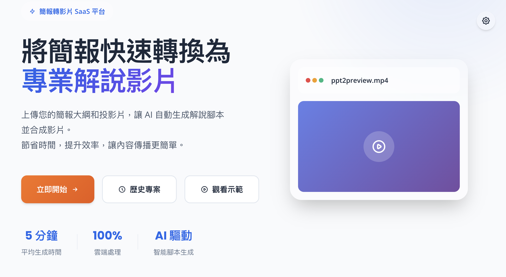
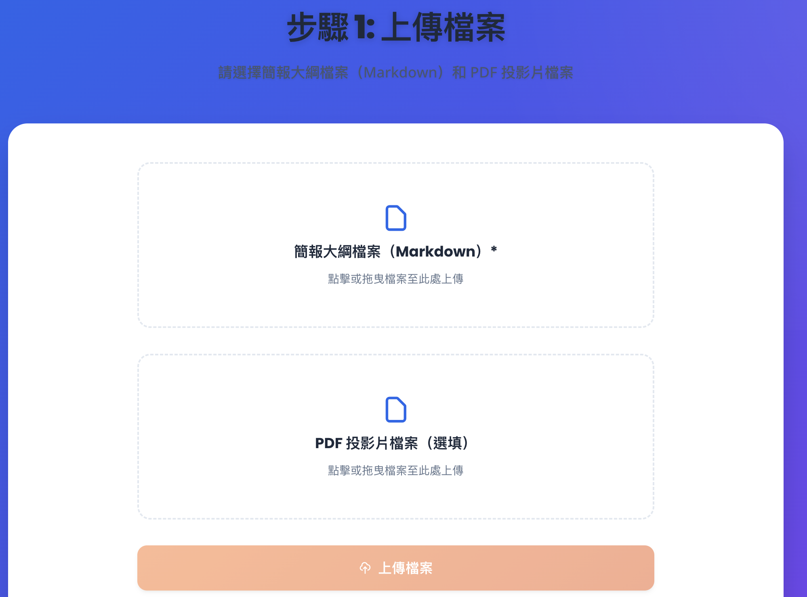
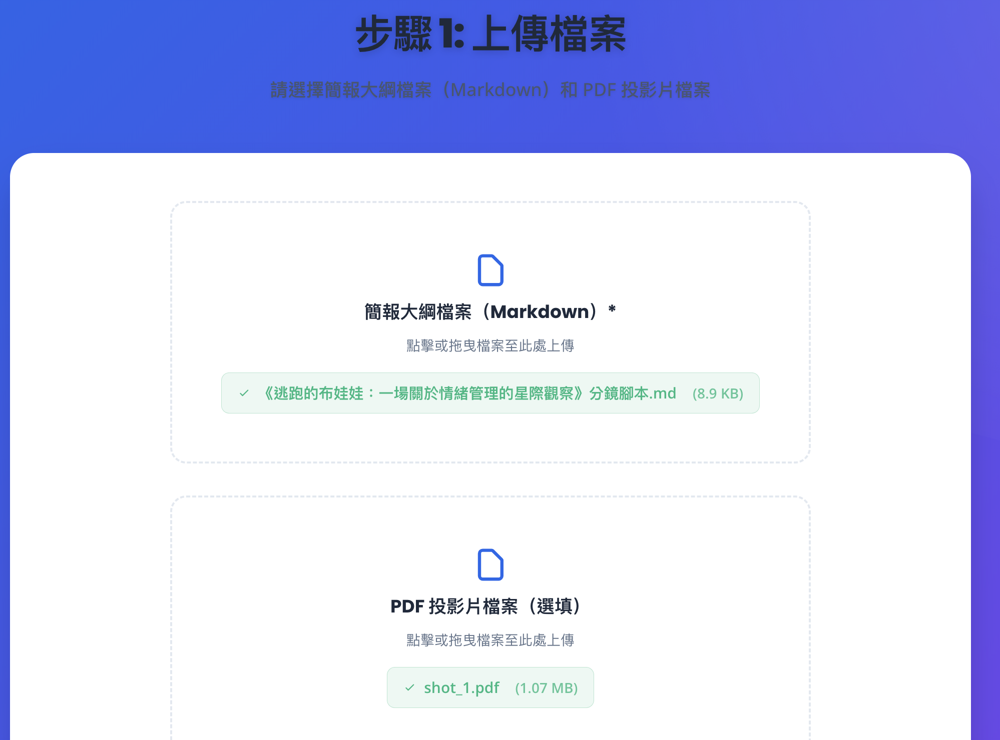
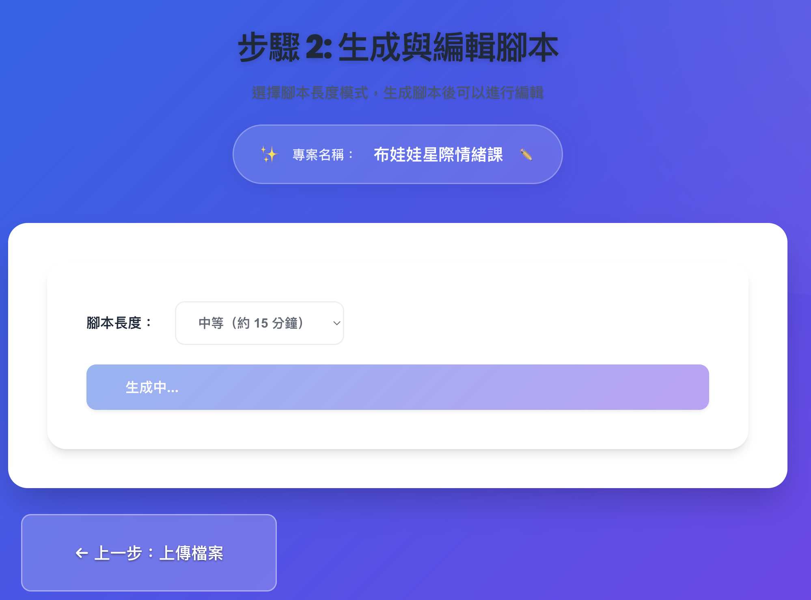
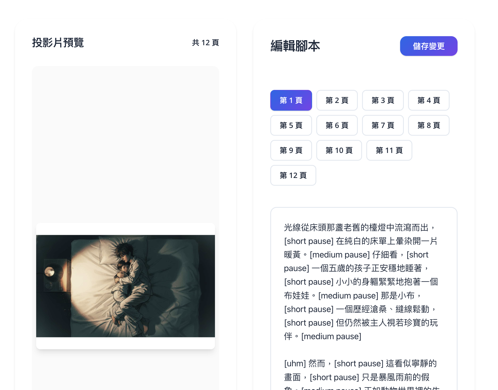
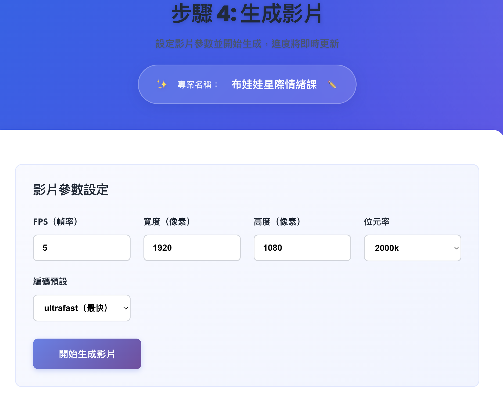
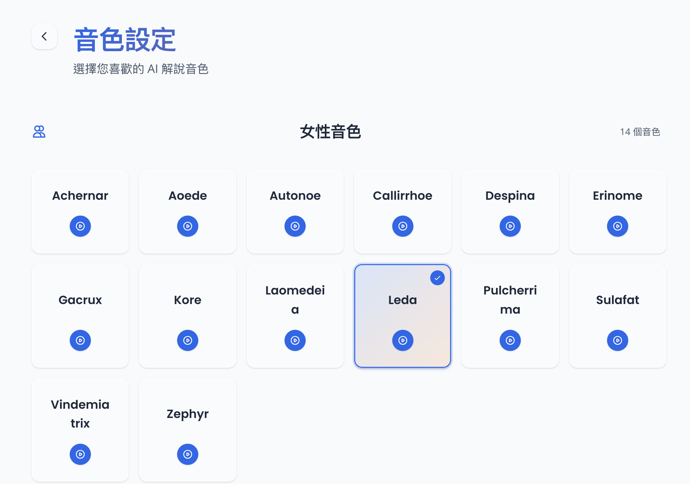
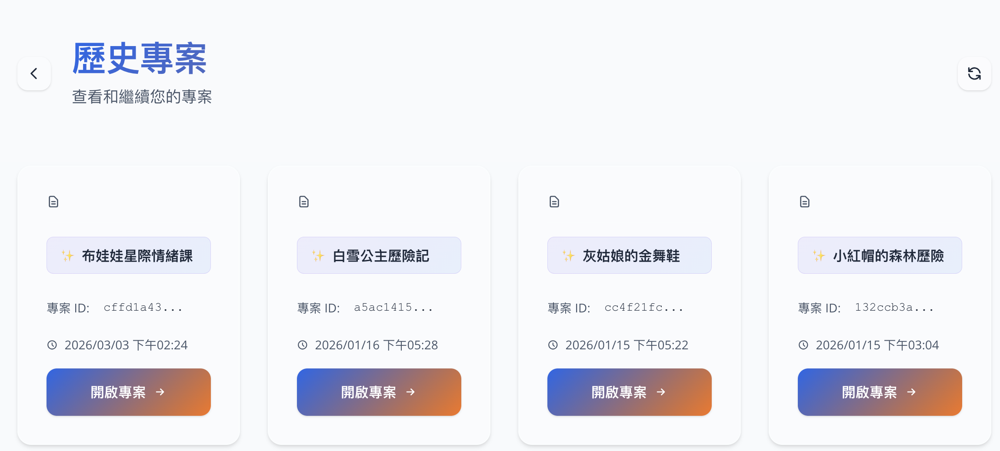

# PPT2Preview - 投影片影片生成平台

一個現代化的 SaaS 服務，將投影片和大綱自動轉換為帶有 AI 語音解說的專業影片。

---

## 📸 系統介面與流程介紹

以下依實際操作流程介紹各畫面與功能。

### 首頁

從首頁可快速了解產品價值與四大步驟，並一鍵開始新專案。



- **Hero 區塊**：主標、副標與「開始製作」CTA
- **功能亮點**：快速上傳、AI 腳本、靈活編輯、自動生成影片、即時下載、雲端處理
- **流程步驟**：上傳檔案 → 生成腳本 → 優化編輯 → 生成影片

---

### 步驟 1：上傳檔案

上傳 Markdown 大綱與 PDF/PPTX 投影片，系統會建立專案並進入後續流程。

| 上傳完成前 | 上傳完成後（可編輯專案名稱） |
|------------|------------------------------|
|  |  |

- **大綱**：Markdown（.md），用於 AI 生成解說方向與重點
- **投影片**：PDF 或 PPTX，將被轉成逐頁圖片並與語音同步
- **專案名稱**：上傳後可於頁面上直接編輯並儲存

---

### 步驟 2：生成腳本

系統以 Google Gemini 2.0 Flash 根據投影片內容與大綱自動產生解說腳本。



- 一鍵觸發「生成腳本」，無需手寫全文
- 生成完成後可檢視、複製，並進入下一步優化


- 每段腳本對應單一投影片頁，方便後續與畫面同步

---

### 步驟 3：優化腳本

在此可調整腳本長度與內容，再進入影片生成。



- **長度模式**：短 / 中 / 長，一鍵重新優化整份腳本
- **手動編輯**：在編輯器中直接修改任一頁的文案
- **儲存**：確認後儲存為最終腳本，供 TTS 與影片合成使用

---

### 步驟 4：生成影片

選擇 TTS 音色、設定影片參數後，一鍵合成影片並即時查看進度。



- **即時進度**：透過 WebSocket 顯示腳本處理、語音生成、影片合成等階段
- **參數**：可調整背景音樂音量、淡入淡出時間等
- 合成完成後會自動導向下載頁

---

### 步驟 5：下載影片

預覽成品並下載 MP4 檔案。


- 頁面內嵌預覽播放器，可先確認再下載
- 下載為標準 MP4，方便分享或上傳至其他平台

---

### 設定：音色選擇

在設定頁可試聽並選擇 TTS 音色，偏好會本地持久化。



- **30 種音色**：14 種女性、16 種男性，均支援繁體中文
- **試聽**：每種音色可試聽後再決定是否採用

---

### 歷史專案

可查看過往專案並重新開啟，繼續編輯或重新生成。



- 列表顯示專案名稱與建立時間
- 點選專案可依當前狀態進入對應步驟（上傳 / 腳本 / 優化 / 影片 / 下載）

---

## ✨ 功能特色

### 核心功能
- 📤 **智能上傳** - 支援 PDF/PPTX 投影片 + Markdown 大綱同時上傳
- 🤖 **AI 腳本生成** - 使用 Google Gemini 2.0 Flash 根據投影片內容和大綱自動生成解說腳本
- ✏️ **腳本優化** - 支援三種長度模式（短/中/長），可手動編輯調整
- 🎙️ **多音色 TTS** - 支援 30 種 Google Cloud TTS 音色（14 女性 + 16 男性），使用 Gemini 2.5 Flash TTS
- 🎬 **自動合成影片** - 逐頁同步語音與投影片，生成專業影片
- 📊 **實時進度追蹤** - WebSocket 實時顯示生成進度
- 📁 **歷史專案管理** - 查看並重新開啟過去的專案

### 技術亮點
- ⚡ 多線程音訊處理，加速生成速度
- 🎨 Glassmorphism 現代化 UI 設計
- 🌓 完整響應式設計，支援桌面/平板/手機
- 💾 本地持久化設定（音色選擇）
- 🔄 自動狀態恢復，支援中斷後繼續

## 🏗️ 技術架構

### 後端 (Python + FastAPI)
- **框架**: FastAPI + Uvicorn
- **AI 模型**: Google Gemini 2.0 Flash（腳本生成與優化）
- **TTS**: Google Cloud Text-to-Speech API (Gemini 2.5 Flash TTS)
- **影片處理**: MoviePy
- **檔案處理**: pdf2image, python-pptx, Pillow
- **通訊**: WebSocket (實時進度推送)

### 前端 (React + TypeScript)
- **框架**: React 18 + TypeScript + Vite
- **樣式**: CSS Variables + Glassmorphism
- **字體**: Poppins (標題) + Open Sans (內文)
- **狀態管理**: Zustand
- **路由**: React Router v6
- **圖標**: SVG (Heroicons 風格)

## 📋 系統需求

### 後端需求
- Python 3.10+
- Google Cloud 專案（啟用 Text-to-Speech API）
- Gemini API Key（Gemini 2.0 Flash 模型）
- 以下環境變數：
  ```bash
  GEMINI_API_KEY=your_gemini_api_key
  ```

### 前端需求
- Node.js 16+
- npm 或 yarn

## 🚀 快速開始

### 方式一：使用快速啟動腳本（推薦）

#### 1. 克隆專案
```bash
git clone https://github.com/poirotw66/ppt2preview.git
cd ppt2preview
```

#### 2. 環境設定
創建 `.env` 文件並設定環境變數：
```bash
# .env 文件內容
GEMINI_API_KEY=your_gemini_api_key
```


#### 3. 啟動服務

**終端機 1 - 啟動後端：**
```bash
# 給予執行權限（首次執行）
chmod +x start_backend.sh

# 啟動後端 API 服務（端口 8000）
./start_backend.sh
```
- 後端服務會自動載入 `.env` 環境變數
- 需要預先配置 Conda 環境（p2v）
- 服務地址：`http://localhost:8000`
- API 文檔：`http://localhost:8000/docs`

**終端機 2 - 啟動前端：**
```bash
# 給予執行權限（首次執行）
chmod +x start_frontend.sh

# 啟動前端開發服務器（端口 3000）
./start_frontend.sh
```
- 腳本會自動檢查並安裝依賴（如果 `node_modules` 不存在）
- 服務地址：`http://localhost:3000`

#### 4. 訪問應用
打開瀏覽器訪問：`http://localhost:3000`

---

### 方式二：手動啟動

#### 1. 克隆專案
```bash
git clone https://github.com/poirotw66/ppt2preview.git
cd ppt2preview
```

#### 2. 後端設置
```bash
# 安裝依賴
pip install -r backend/requirements.txt

# 設定環境變數
export GEMINI_API_KEY="your_gemini_api_key"

# 啟動後端服務（端口 8000）
cd backend
uvicorn main:app --host 0.0.0.0 --port 8000 --reload
```

#### 3. 前端設置
```bash
# 安裝依賴
cd frontend
npm install

# 啟動開發伺服器（端口 3000）
npm run dev
```

#### 4. 訪問應用
打開瀏覽器訪問：`http://localhost:3000`

## 📖 使用流程總覽

完整畫面與說明請見上方 **[📸 系統介面與流程介紹](#-系統介面與流程介紹)**。

| 步驟 | 說明 |
|------|------|
| 1. 上傳檔案 | 上傳 Markdown 大綱與 PDF/PPTX 投影片，可自訂專案名稱 |
| 2. 生成腳本 | 一鍵由 AI 根據投影片與大綱產生逐頁解說腳本 |
| 3. 優化腳本 | 選擇短/中/長模式或手動編輯，儲存為最終腳本 |
| 4. 生成影片 | 選擇 TTS 音色與影片參數，即時查看進度並合成影片 |
| 5. 下載影片 | 預覽後下載 MP4 檔案 |

另可於 **設定** 頁試聽並選擇 30 種 TTS 音色，於 **歷史專案** 頁重新開啟過往專案。

## 🎨 設計系統

### 色彩方案
- **主色**: 信任藍 (#2563EB)
- **次要色**: 藍色調 (#3B82F6)
- **CTA**: 活力橙 (#F97316)
- **背景**: 漸變色 (藍紫到粉紅)

### UI 特點
- Glassmorphism (玻璃態效果)
- 流暢的過渡動畫
- 無障礙設計 (WCAG AA 標準)
- 支援 `prefers-reduced-motion`

## 📂 專案結構

```
ppt2preview/
├── backend/
│   ├── api/              # API 路由和模型
│   ├── services/         # 業務邏輯服務
│   ├── utils/            # 工具函數
│   └── main.py           # FastAPI 入口
├── frontend/
│   ├── src/
│   │   ├── components/   # React 組件
│   │   ├── pages/        # 頁面組件
│   │   ├── services/     # API 客戶端
│   │   ├── store/        # 狀態管理
│   │   └── types/        # TypeScript 類型
│   └── public/
│       └── voice/        # TTS 音色試聽檔案
├── output/               # 生成的專案輸出
└── requirements.txt      # Python 依賴
```

## 🎙️ 支援的音色

- **女性音色 (14 種)**: Achernar, Aoede, Autonoe, Callirrhoe, Despina, Erinome, Gacrux, Kore, Laomedeia, Leda, Pulcherrima, Sulafat, Vindemiatrix, Zephyr
- **男性音色 (16 種)**: Achird, Algenib, Algieba, Alnilam, Charon, Enceladus, Fenrir, Iapetus, Orus, Puck, Rasalgethi, Sadachbia, Sadaltager, Schedar, Umbriel, Zubenelgenubi

所有音色均支援繁體中文，可在設定頁面試聽和選擇。

## 🔧 API 端點

### REST API
- `POST /api/v1/upload` - 上傳檔案
- `GET /api/v1/task/{task_id}/status` - 獲取任務狀態
- `POST /api/v1/generate-script` - 生成腳本
- `POST /api/v1/optimize-script` - 優化腳本
- `POST /api/v1/generate-video` - 生成影片
- `GET /api/v1/history` - 獲取歷史專案列表
- `GET /api/v1/download/{task_id}` - 下載影片

### WebSocket
- `WS /api/v1/ws/{task_id}` - 實時進度推送

## 📊 輸出檔案

每個專案在 `output/{task_id}/` 目錄下生成：
```
output/{task_id}/
├── slides/              # 投影片圖片
├── audio_segments/      # 音訊片段
├── outline.md           # 原始大綱
├── script.json          # 生成的腳本
├── optimized_script.json # 優化後的腳本
└── final_video.mp4      # 最終影片
```

## 🐛 故障排除

### 常見問題

1. **TTS API 錯誤**
   - 檢查 Google Cloud 專案是否啟用 Text-to-Speech API

2. **Gemini API 錯誤**
   - 確認 `GEMINI_API_KEY` 設定正確
   - 檢查 API 配額是否充足

3. **影片生成失敗**
   - 確認 `pdf2image` 正確安裝（需要 poppler）
   - 檢查磁碟空間是否充足

4. **前端連接失敗**
   - 確認後端運行在 `http://localhost:8000`
   - 檢查防火牆設定

## 📝 開發筆記

### 效能優化
- 圖片縮放使用 JPEG (quality=95) 而非 PNG，速度提升 3-5 倍
- 多線程音訊生成，支援並行處理
- 使用 `thumbnail()` 方法進行圖片縮小，速度提升 20-30%

### 安全性
- 檔案上傳大小限制 (10MB)
- 任務 ID 使用 UUID，防止猜測
- CORS 設定限制來源

## 🤝 貢獻

歡迎提交 Issue 和 Pull Request！

## 📄 授權

MIT License

## 👨‍💻 作者

poirotw66

---

**注意**: 本專案需要 Google Cloud 憑證和 Gemini API Key 才能運行。請確保在使用前正確設定環境變數。

